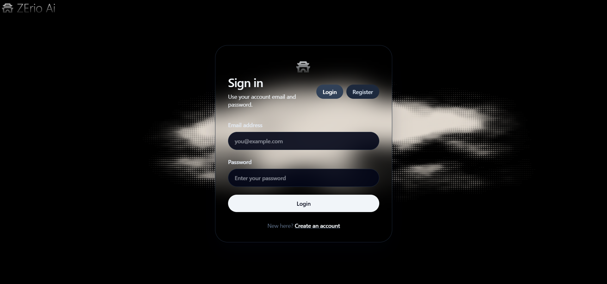
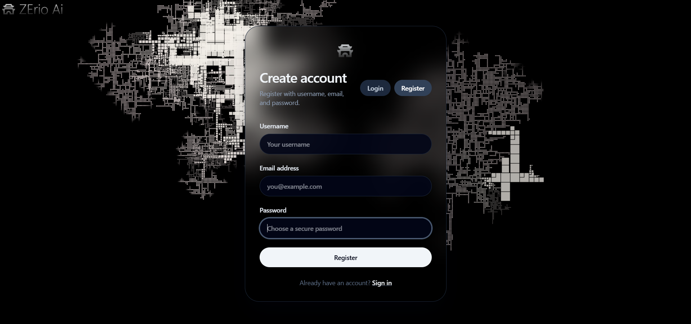
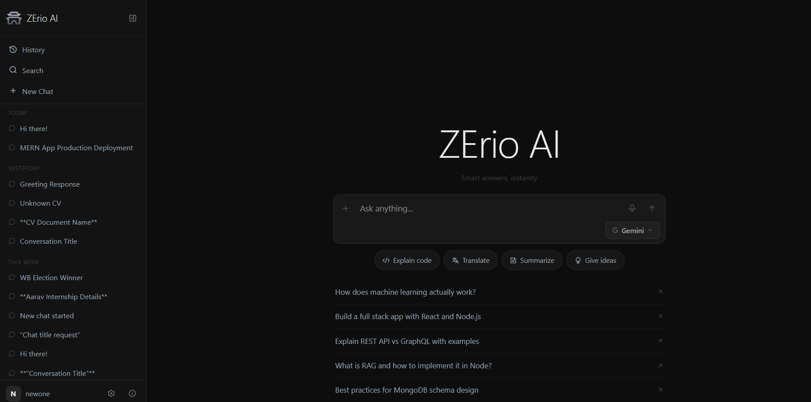
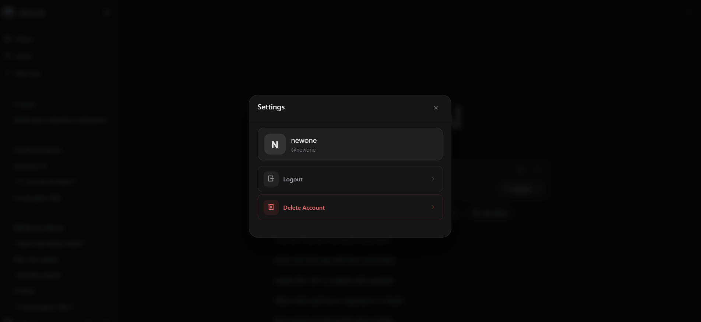
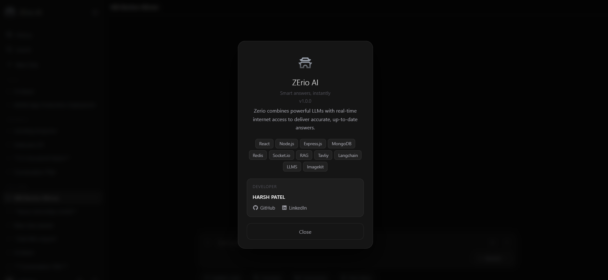
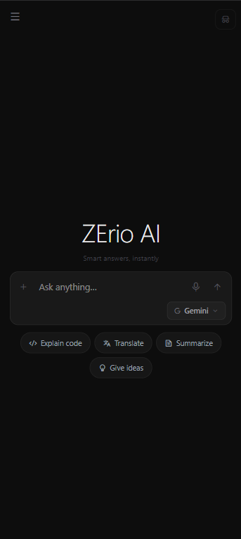

<div align="center">


# ⚡ ZErio AI

### *Intelligence. Redefined.*

**A full-stack AI chat platform powered by multiple LLMs — with RAG, real-time internet search, vision, document understanding, and more.**

<br/>

[](https://zerio-ai.onrender.com)
[](https://github.com/Notanormaldev)
[](https://www.linkedin.com/in/harsh-patel-a77148314/)
[](https://github.com/Notanormaldev/ZErio-Ai)

</div>

---

## 📸 Screenshots

<div align="center">

| Login | Register |
|-------|----------|
|  |  |

| Chat UI | Settings |
|---------|----------|
|  |  |

| About | Mobile View |
|-------|-------------|
|  |  |

</div>

---

## ✨ What is ZErio AI?

ZErio AI is a production-grade AI assistant platform that connects multiple state-of-the-art language models under one sleek interface. It goes beyond a simple chatbot — with **RAG-powered document intelligence**, **real-time web search**, **image understanding**, and **live streaming responses** — all secured with Redis-backed authentication and delivered with socket-powered real-time communication.

---

## 🚀 Core Features

### 🤖 Multi-LLM Support
Switch between the world's most powerful AI models in one click:

| Model | Provider |
|-------|----------|
| Gemini 1.5 Pro / Flash | Google |
| GPT-4o / GPT-4 Turbo | OpenAI |
| Mistral Large | Mistral AI |
| Command R+ | Cohere |
| DeepSeek V3 | DeepSeek |

### 🧠 RAG — Document Intelligence
Upload your files and chat with them directly. ZErio AI parses and understands:
- 📄 PDF documents
- 📝 DOCX / Word files
- 🗂️ JSON data files

### 🌐 Real-Time Internet Search
Powered by **Tavily Search API** + **LangChain** — ZErio AI can search the web in real-time and ground responses in current, accurate information.

### 👁️ Vision — Image Understanding
Upload any image and ask questions about it. ZErio AI uses multimodal LLMs to analyze, describe, and reason over visual content.

### ⚡ Live Streaming Responses
Responses stream token-by-token in real time via **Socket.io** — no waiting, just instant intelligence.

### 🔐 Secure Auth System
- JWT-based authentication
- Email verification flow with beautiful HTML emails
- **Redis**-powered token blacklisting on logout
- HttpOnly cookie sessions

### 📁 File & Image Management
All uploaded files and images are stored and managed via **ImageKit CDN** — fast, optimized, and globally delivered.

---

## 🛠️ Tech Stack

### Backend
| Technology | Purpose |
|------------|---------|
| Node.js + Express | REST API server |
| MongoDB + Mongoose | Primary database |
| Redis | Session management & logout blacklist |
| Socket.io | Real-time LLM streaming |
| LangChain | LLM orchestration & RAG pipeline |
| Tavily Search API | Real-time internet search |
| ImageKit | File & image storage CDN |
| Brevo (SMTP) | Transactional email delivery |
| JWT | Authentication tokens |

### Frontend
| Technology | Purpose |
|------------|---------|
| React + Vite | UI framework |
| Tailwind CSS | Styling |
| Axios | HTTP client |
| React Router | Client-side routing |
| Socket.io Client | Real-time communication |

### AI / LLM Integrations
| Integration | Usage |
|------------|-------|
| Google Gemini | Primary LLM |
| OpenAI GPT | Alternative LLM |
| Mistral AI | Alternative LLM |
| Cohere Command | Alternative LLM |
| DeepSeek | Alternative LLM |
| Tavily | Web search grounding |
| LangChain | RAG + orchestration |

---

## 🏗️ Architecture Overview

```
User Request
     │
     ▼
React Frontend (Vite)
     │  Socket.io + REST
     ▼
Express Backend
     ├── Auth (JWT + Redis + Brevo Email)
     ├── LLM Router (Gemini / GPT / Mistral / Cohere / DeepSeek)
     ├── RAG Pipeline (LangChain + Vector Store)
     │       └── PDF / DOCX / JSON Parser
     ├── Web Search (Tavily API)
     ├── Vision (Multimodal LLM)
     └── File Storage (ImageKit CDN)
     │
     ▼
MongoDB (Chats, Users, Documents)
Redis  (Session Blacklist)
```

---

## 🌟 Highlights for Recruiters

- ✅ **Production Deployed** — Live on Render with real users
- ✅ **Multi-LLM Architecture** — Engineered to swap models without changing business logic
- ✅ **RAG Implementation** — Built a full retrieval-augmented generation pipeline from scratch
- ✅ **Real-time Streaming** — Socket.io for live token-by-token LLM output
- ✅ **Secure by Design** — Redis token blacklisting, HttpOnly cookies, email verification
- ✅ **Full-Stack** — End-to-end ownership from DB schema to UI animations
- ✅ **Clean Code** — Modular service-based backend, component-driven frontend

---

## 👨‍💻 Author

<div align="center">

**Harsh Patel**

*Full-Stack Developer · AI Engineer*

[](https://github.com/Notanormaldev)
[](https://www.linkedin.com/in/harsh-patel-a77148314/)
[](https://zerio-ai.onrender.com)

</div>

---

<div align="center">

*Built for the future. ⚡*

**© 2026 ZErio AI — All rights reserved.**

</div>
